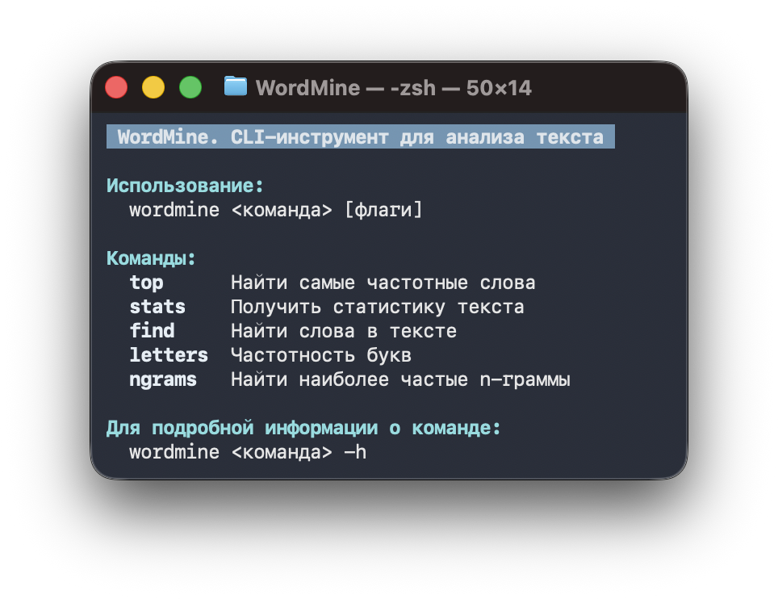
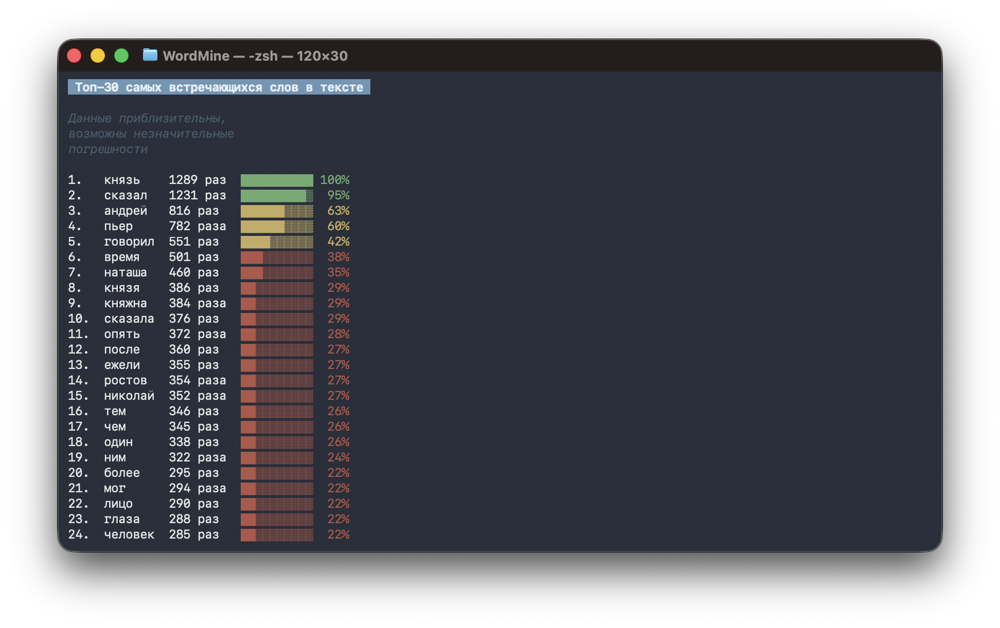
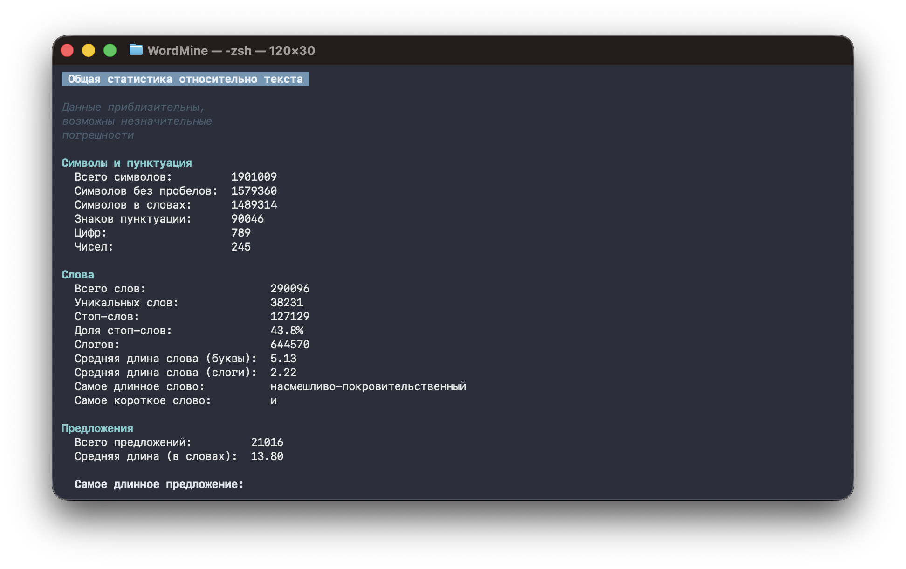
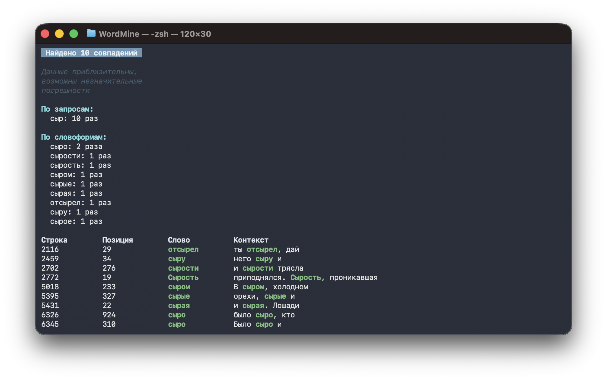
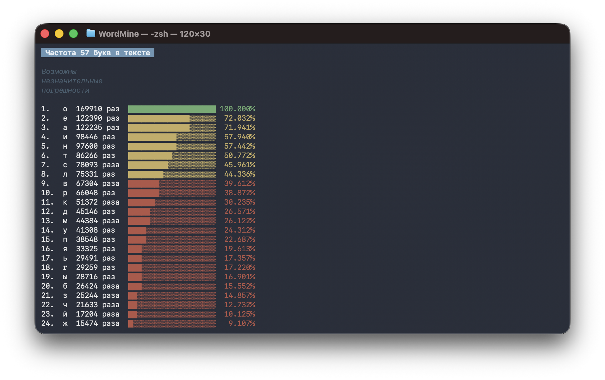
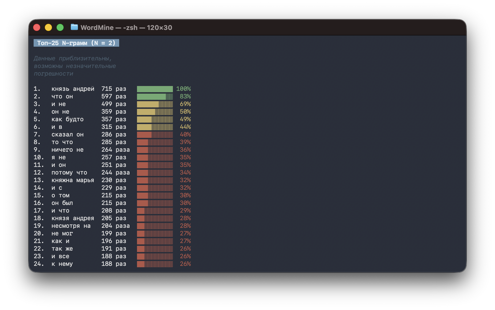

<div align="center">

  


CLI-инструмент и библиотека для частотного и статистического анализа текста на русском языке, написанные на Go


</div>

## Оглавление

- [Скриншоты CLI](#скриншоты-cli)
- [Возможности](#возможности)
- [Установка](#установка)
- [Использование CLI](#использование-cli)
- [Экспорт](#экспорт)
- [Ограничения](#ограничения)
- [Планы на v2](#планы-на-v2)
- [Архитектура](#архитектура)
- [Лицензия и атрибуция](#лицензия-и-атрибуция)

## Скриншоты CLI

### Интерфейс
<div align="center">

  

</div>

### Топ слов
<div align="center">

  

</div>

### Статистика текста
<div align="center">

  

</div>

### Поиск в тексте
<div align="center">

  

</div>

### Частотность букв
<div align="center">

  

</div>

### N-граммы
<div align="center">

  

</div>

## Возможности

**Топ слов** - самые частые слова текста, с фильтрацией стоп-слов и по длине слова

**Статистика текста** - длина слов и предложений, лексическое разнообразие, индекс читаемости, слоги и так далее

**Поиск по тексту** - слова и подстроки с контекстом вхождения

**Частота букв** - распределение букв по всему тексту

**N-граммы** - самые частые устойчивые последовательности слов

**Экспорт** - любой результат можно сохранить в JSON или TXT

## Установка

### Как CLI-инструмент

Если установлен Go:

```
go install github.com/westside-jpg/WordMine/cmd/wordmine@latest
```

Команда `wordmine` станет доступна из любой директории (при условии, что
`$GOPATH/bin` добавлен в `PATH`).

### Как библиотека

```
go get github.com/westside-jpg/WordMine
```

Пример использования:
```go
import "github.com/westside-jpg/WordMine/services"

top, err := services.TopWords("book.txt", types.TopWordsOptions{Limit: 10})
```

## Использование CLI

```
wordmine <команда> [флаги]
wordmine <команда> -h   # подробная справка по конкретной команде
```
### Команды
---

### `top` - топ самых частых слов

| Флаг | Тип | По умолчанию | Описание |
|---|---|---|---|
| `-file` | string | - (обязателен) | Путь к текстовому файлу |
| `-limit` | int | `10` | Сколько слов вернуть |
| `-length` | int | `0` (любая длина) | Учитывать только слова заданной длины |
| `-case-sensitive` | bool | `false` | Учитывать регистр |
| `-exclude-stopwords` | bool | `false` | Исключить предлоги, союзы, частицы |
| `-export` | string | - | Путь для сохранения (`.txt` или `.json`) вместо вывода в терминал |

```
wordmine top -file book.txt -limit 20 -exclude-stopwords
```

### `stats` - статистика текста

| Флаг | Тип | По умолчанию | Описание |
|---|---|---|---|
| `-file` | string | - (обязателен) | Путь к текстовому файлу |
| `-export` | string | - | Путь для сохранения (`.txt` или `.json`) вместо вывода в терминал |

```
wordmine stats -file book.txt -export report.json
```

### `find` - поиск слов в тексте

| Флаг | Тип | По умолчанию | Описание |
|---|---|---|---|
| `-file` | string | - (обязателен) | Путь к текстовому файлу |
| `-search` | string | - (обязателен) | Слова для поиска через запятую |
| `-case-sensitive` | bool | `false` | Учитывать регистр |
| `-whole-word` | bool | `false` | Искать только целые слова, а не подстроки |
| `-export` | string | - | Путь для сохранения (`.txt` или `.json`) вместо вывода в терминал |

```
wordmine find -file book.txt -search "свет,путь" -case-sensitive -whole-word
```

### `letters` - частотность букв

| Флаг | Тип | По умолчанию | Описание |
|---|---|---|---|
| `-file` | string | - (обязателен) | Путь к текстовому файлу |
| `-export` | string | - | Путь для сохранения (`.txt` или `.json`) вместо вывода в терминал |

```
wordmine letters -file book.txt
```

### `ngrams` - частые последовательности слов

| Флаг | Тип | По умолчанию | Описание |
|---|---|---|---|
| `-file` | string | - (обязателен) | Путь к текстовому файлу |
| `-n` | int | `2` | Количество слов в одной n-грамме |
| `-limit` | int | `10` | Сколько n-грамм вернуть |
| `-case-sensitive` | bool | `false` | Учитывать регистр |
| `-export` | string | - | Путь для сохранения (`.txt` или `.json`) вместо вывода в терминал |

```
wordmine ngrams -file book.txt -n 3 -limit 15
```

## Экспорт

Формат экспорта определяется по расширению файла, переданного в `-export`:

- `.json` - структурированные данные, удобно для дальнейшей машинной обработки
- `.txt` - тот же вывод, что печатается в терминал, без цвета, для чтения человеком

## Ограничения

Часть метрик (число слогов, индекс читаемости, границы предложений)
являются эвристическими приближениями, а не точным лингвистическим
анализом - это фундаментальное свойство частотного подхода без
морфологического движка

## Планы на v2

- **Поиск по словосочетанию** - команда `find` сейчас ищет только по
  отдельным словам. В v2 планируется поддержка поиска целых фраз
  (например, "война и мир" как единое выражение), а не только отдельных слов
  или подстрок
- **Сравнение двух текстов** - новая команда для сопоставления двух
  файлов: общий и уникальный словарь, сходство по стилю письма
  (длина слов и предложений, читаемость, лексическое разнообразие),
  общие частые словосочетания

## Архитектура

```
.
├── cmd/wordmine/    - точка входа CLI-программы
├── docs/            - скриншоты и лого для README
├── export/          - экспорт результатов в JSON/TXT
├── formatting/      - форматированный вывод результатов в терминал
├── services/        - основная логика анализа текста
├── stopwords/       - список стоп-слов по умолчанию
├── types/           - структуры опций и результатов
├── utils/           - вспомогательные функции (очистка слов, разбиение
│                       на предложения и так далее)
├── go.mod
├── go.sum
├── LICENSE
└── README.md
```

## Лицензия и атрибуция

### Код проекта
Проект распространяется под лицензией MIT. Подробнее в файле [LICENSE](LICENSE)

### Сторонние зависимости

**fatih/color**
Лицензия MIT
Репозиторий [https://github.com/fatih/color](https://github.com/fatih/color)
Текст лицензии [https://github.com/fatih/color/blob/main/LICENSE.md](https://github.com/fatih/color/blob/main/LICENSE.md)

**kljensen/snowball**
Лицензия MIT
Репозиторий [https://github.com/kljensen/snowball](https://github.com/kljensen/snowball)
Текст лицензии [https://github.com/kljensen/snowball/blob/master/LICENSE](https://github.com/kljensen/snowball/blob/master/LICENSE)

**mattn/go-colorable**
Лицензия MIT
Репозиторий [https://github.com/mattn/go-colorable](https://github.com/mattn/go-colorable)
Текст лицензии [https://github.com/mattn/go-colorable/blob/master/LICENSE](https://github.com/mattn/go-colorable/blob/master/LICENSE)

**mattn/go-isatty**
Лицензия MIT
Репозиторий [https://github.com/mattn/go-isatty](https://github.com/mattn/go-isatty)
Текст лицензии [https://github.com/mattn/go-isatty/blob/master/LICENSE](https://github.com/mattn/go-isatty/blob/master/LICENSE)

**golang.org/x/sys**
Лицензия BSD-3-Clause
Репозиторий [https://cs.opensource.google/go/x/sys](https://cs.opensource.google/go/x/sys)
Текст лицензии [https://cs.opensource.google/go/x/sys/+/master:LICENSE](https://cs.opensource.google/go/x/sys/+/master:LICENSE)

**Go**
Лицензия BSD-3-Clause с патентной оговоркой
Разработчик The Go Authors
Текст лицензии [https://github.com/golang/go/blob/master/LICENSE](https://github.com/golang/go/blob/master/LICENSE)